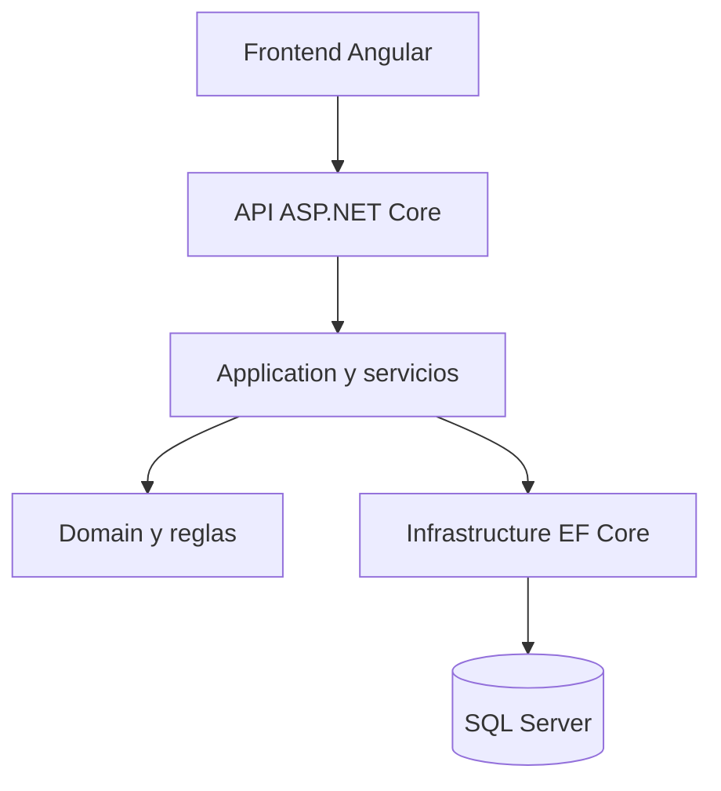
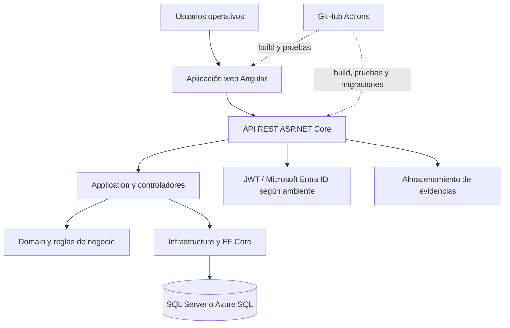

# Diseño técnico

## Arquitectura lógica

La solución está organizada en capas:



## Arquitectura de alto nivel

La siguiente vista resume la interrelación entre la aplicación web, los servicios web, la lógica de negocio, la persistencia, la identidad y el ciclo de entrega. El archivo fuente UML [03-arquitectura-alto-nivel.puml](diagramas/03-arquitectura-alto-nivel.puml) permite recrear el modelo como un diagrama de componentes en Enterprise Architect.



La API concentra los servicios web de autenticación, autorización, catálogos, llantas, inventario, inspecciones, alertas, programación, operaciones, servicios y reportes. La base de datos conserva la información transaccional, la seguridad y la auditoría; las evidencias se almacenan según la configuración del ambiente.

## Tecnologías observables

| Componente | Tecnología |
|---|---|
| Frontend | Angular 20, TypeScript, SCSS |
| Backend | ASP.NET Core sobre .NET 10 |
| Acceso a datos | Entity Framework Core |
| Base de datos | SQL Server |
| Autenticación | Usuario/contraseña y JWT; integración de identidad según ambiente |
| Pruebas | Pruebas de dominio, aplicación, integración y frontend |
| Automatización | GitHub Actions para verificación y artefactos |

## Componentes del backend

- `SistemaLlantas.Api`: controladores, autenticación, middleware y configuración.
- `SistemaLlantas.Application`: DTO, casos de uso, contratos y validaciones.
- `SistemaLlantas.Domain`: entidades, estados, reglas y conceptos del negocio.
- `SistemaLlantas.Infrastructure`: DbContext, configuraciones, migraciones y servicios.

## Componentes funcionales identificados

La API contiene controladores para autenticación, carga masiva, catálogos, dashboard, inspecciones, inventario, llantas, operaciones, parámetros de alertas, programación, reportes, roles, servicios, usuarios, importación de usuarios y vehículos.

## Datos y persistencia

El contexto `LlantasDbContext` centraliza la persistencia. El proyecto incluye migraciones para catálogos, inspecciones, operaciones, seguridad persistida, centros regionales, seguridad multicentro, configuraciones de vehículos, kilometraje del ciclo de vida, alertas, programación, flujos operativos, trazabilidad de llantas encontradas, idempotencia, reparaciones y reencauche, identidad y reglas configurables de alertas.

## Frontend

Las funcionalidades están organizadas por características: autenticación, administración de catálogos, alertas, autorizaciones, carga masiva, dashboard, inspección, inventario, llantas, movimientos, programación, servicios y vehículos. Las rutas y guards deben mantenerse alineados con los permisos del backend.

## Configuración local

```text
SQL Server: localhost\\SQLEXPRESS
API local: http://localhost:5262
Frontend: frontend/sistema-llantas
```

Consultar `README.md` y `docs/mvp-operacion.md` para el procedimiento de arranque del ambiente local. Las credenciales de desarrollo deben estar fuera del repositorio y los usuarios demo solo deben habilitarse en una base de desarrollo.
