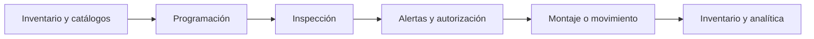

# Guía de operación y QA

## Flujo operativo esperado

## Preparación de pruebas

- Confirmar ambiente, conexión a SQL Server y usuarios de prueba.
- Cargar un conjunto controlado de llantas, vehículos, posiciones, centros y técnicos.
- Validar que cada usuario tenga el rol y alcance de centros esperado.
- Preparar datos con llantas nuevas, usadas, reencauchadas, disponibles, montadas y en reparación.
- Definir resultado esperado para cada regla de alerta.

## Pruebas por perfil

| Perfil | Escenarios mínimos |
|---|---|
| Técnico | Crear inspección, registrar profundidades, adjuntar evidencia, reportar inconsistencia y consultar historial |
| Supervisor | Crear programación, consultar vehículo, revisar pendientes, autorizar o rechazar solicitudes |
| Líder de taller | Consultar inventario, enviar a reencauche, recibir, disponer y validar centros |
| Administrador | Gestionar catálogos, parámetros, roles, usuarios y permisos |

## Pruebas end-to-end

1. Crear o seleccionar vehículo.
2. Crear programación de inspección.
3. Registrar inspección completa y verificar alertas.
4. Registrar una inspección incompleta y verificar que se solicite motivo.
5. Adjuntar evidencia y comprobar autorización de consulta.
6. Ejecutar montaje, rotación o reparación y verificar historial.
7. Enviar una llanta a reencauche y registrar recepción.
8. Confirmar que inventario, posición, ciclo de vida y dashboard queden consistentes.

## Criterios de salida

- Sin defectos críticos o de seguridad abiertos.
- Reglas de autorización verificadas desde API y frontend.
- Datos de inventario y movimientos conciliados.
- Pruebas con usuarios finales completadas durante tres a cinco días.
- Indicadores aprobados por negocio.
- Evidencia de pruebas y pendientes documentados.
- Procedimiento de reversa y soporte definido.
